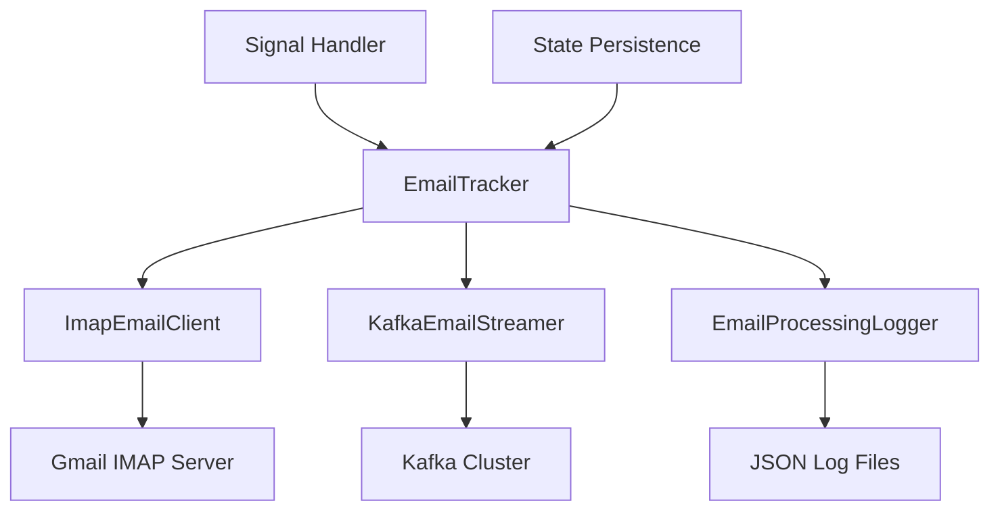
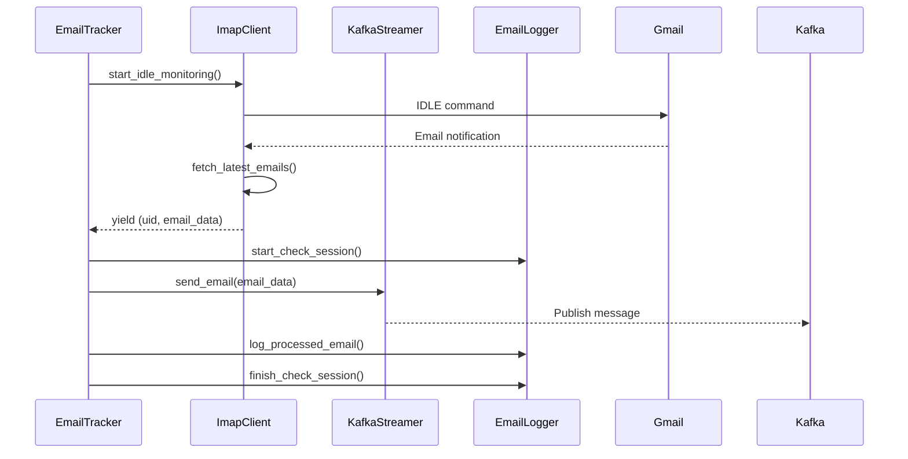

# Development Guide

## 🏗️ Kiến Trúc Chi Tiết

### Component Interaction Flow



### Data Flow



## 💾 Data Models

### EmailData Model
```python
class EmailData(BaseModel):
    message_id: str              # Unique message identifier
    subject: str                 # Email subject
    sender: str                  # From address
    recipients: List[str]        # To addresses
    cc: Optional[List[str]]      # CC addresses  
    bcc: Optional[List[str]]     # BCC addresses
    date: datetime               # Email date
    body_text: Optional[str]     # Plain text body
    body_html: Optional[str]     # HTML body
    attachments: List[EmailAttachment]  # File attachments
    flags: List[str]             # IMAP flags
    folder: str                  # Source folder
```

### EmailStreamMessage Model
```python
class EmailStreamMessage(BaseModel):
    timestamp: datetime          # Processing timestamp
    email: EmailData            # Email content
    source: str                 # Source identifier
```

## 🔧 Core Algorithms

### 1. UID-based Deduplication

```python
def process_emails():
    # Load processed UIDs from logs
    processed_uids = get_processed_uids_for_date(datetime.now())
    
    # Fetch emails from IMAP
    all_messages = imap_client.search(['SINCE', date])
    
    # Filter out already processed  
    new_messages = [uid for uid in all_messages 
                   if uid not in processed_uids]
    
    # Process only new emails
    for uid in new_messages:
        process_email(uid)
        processed_uids.add(uid)  # Update cache
```

### 2. State Persistence Strategy

```python
def save_state():
    state = {
        'last_check_time': last_check_time.isoformat(),
        'interrupted_at': datetime.now().isoformat(),
        'stats': current_stats
    }
    with open('email_tracker_state.json', 'w') as f:
        json.dump(state, f)

def load_state():
    if os.path.exists('email_tracker_state.json'):
        with open('email_tracker_state.json', 'r') as f:
            state = json.load(f)
            last_check_time = datetime.fromisoformat(state['last_check_time'])
            # Resume from last check time
```

### 3. IMAP IDLE Implementation

```python
def start_idle_monitoring():
    while True:
        # Enter IDLE mode
        client.idle()
        
        # Wait for notifications (5 second timeout)
        responses = client.idle_check(timeout=5)
        
        # Exit IDLE mode
        client.idle_done()
        
        if responses:
            # Process new emails
            yield from fetch_latest_emails()
        # Loop continues for next IDLE cycle
```

## 📊 Performance Characteristics

### Memory Usage Profile
```
Base Application: ~30MB
+ IMAP Connection: ~10MB
+ Kafka Producer: ~5MB  
+ Per Email Cache: ~1KB
+ Log Files: Disk only (not in memory)

Total: ~45MB + (num_emails * 1KB)
```

### Network Traffic
```
IMAP IDLE: ~1KB/30min (keepalive)
Email Fetch: ~5-50KB per email (depends on content)  
Kafka Publish: ~5-50KB per message (same as email size)
```

### Latency Characteristics
```
IDLE Notification: <1 second (real-time)
Email Processing: 100-500ms per email
Kafka Publish: 50-200ms per message
Log Writing: 10-50ms per session
```

## 🧪 Testing Strategy

### Unit Tests Structure
```
tests/
├── test_imap_client.py         # IMAP connection & parsing
├── test_kafka_streamer.py      # Kafka publishing  
├── test_email_logger.py        # Logging functionality
├── test_models.py              # Data model validation
└── test_config.py              # Configuration loading
```

### Mock Strategy
```python
# Mock IMAP responses
@pytest.fixture
def mock_imap_client():
    with patch('imapclient.IMAPClient') as mock:
        mock.return_value.search.return_value = [12345, 12346]
        mock.return_value.fetch.return_value = {
            12345: {b'RFC822': sample_email_bytes}
        }
        yield mock

# Mock Kafka producer
@pytest.fixture  
def mock_kafka_producer():
    with patch('kafka.KafkaProducer') as mock:
        mock.return_value.send.return_value.get.return_value = MagicMock()
        yield mock
```

### Integration Test Scenarios
```python
def test_end_to_end_email_flow():
    """Test complete flow from IMAP to Kafka"""
    # Setup test email in Gmail
    # Start email tracker
    # Verify email processed and sent to Kafka
    # Check logs created correctly

def test_interruption_recovery():
    """Test state persistence across restarts"""  
    # Process some emails
    # Simulate interruption
    # Restart application
    # Verify no duplicate processing
```

## 🔍 Debugging Tools

### Debug Mode Configuration
```python
# Enable debug logging
LOG_LEVEL=DEBUG

# Additional debug settings
IMAP_DEBUG=True
KAFKA_DEBUG=True
```

### Useful Debug Commands
```bash
# Monitor IMAP traffic
python -c "
import imaplib
imaplib.Debug = 4  # Max debug level
# Your IMAP code here
"

# Monitor Kafka messages
docker exec kafka kafka-console-consumer \
  --topic email-stream \
  --bootstrap-server localhost:9092 \
  --from-beginning \
  --property print.key=true

# Analyze log files
jq '.processing_results.processed_uids' Files/Emails/Logs/Daily/*.json

# Check UID deduplication
python -c "
from email_logger import EmailProcessingLogger
logger = EmailProcessingLogger()
uids = logger.get_processed_uids_for_date(datetime.now())
print(f'Processed UIDs: {len(uids)}')
"
```

### Log Analysis Queries
```bash
# Count emails processed per day
ls Files/Emails/Logs/Daily/ | grep $(date +%Y%m%d) | wc -l

# Total emails in all logs
jq -s 'map(.processing_results.total_found) | add' Files/Emails/Logs/Daily/*.json

# Error analysis
jq -s 'map(select(.processing_results.errors > 0))' Files/Emails/Logs/Daily/*.json
```

## ⚡ Performance Optimization

### 1. UID Cache Optimization
```python
class OptimizedUIDCache:
    def __init__(self):
        self.cache = set()
        self.cache_date = None
        self.max_cache_size = 10000  # Prevent memory bloat
    
    def get_processed_uids(self, date):
        if self.needs_refresh(date):
            self.refresh_cache(date)
        return self.cache.copy()
    
    def add_uid(self, uid):
        if len(self.cache) > self.max_cache_size:
            # Keep only recent UIDs
            self.cache = set(sorted(self.cache)[-self.max_cache_size//2:])
        self.cache.add(uid)
```

### 2. Batch Email Processing
```python
def process_emails_batch(emails, batch_size=10):
    """Process emails in batches for better throughput"""
    for i in range(0, len(emails), batch_size):
        batch = emails[i:i + batch_size]
        
        # Process batch
        kafka_futures = []
        for uid, email_data in batch:
            future = kafka_producer.send(topic, email_data)
            kafka_futures.append((uid, future))
        
        # Wait for batch completion
        for uid, future in kafka_futures:
            future.get(timeout=10)  # Confirm delivery
```

### 3. Connection Pooling
```python
class IMAPConnectionPool:
    def __init__(self, max_connections=3):
        self.pool = Queue(maxsize=max_connections)
        self.max_connections = max_connections
    
    def get_connection(self):
        try:
            return self.pool.get_nowait()
        except Empty:
            return self.create_connection()
    
    def return_connection(self, conn):
        try:
            self.pool.put_nowait(conn)
        except Full:
            conn.logout()  # Close excess connections
```

## 🛡️ Error Handling Patterns

### 1. Retry with Exponential Backoff
```python
def retry_with_backoff(func, max_retries=3, base_delay=1):
    for attempt in range(max_retries):
        try:
            return func()
        except Exception as e:
            if attempt == max_retries - 1:
                raise
            
            delay = base_delay * (2 ** attempt)
            logger.warning(f"Attempt {attempt + 1} failed: {e}. Retrying in {delay}s...")
            time.sleep(delay)
```

### 2. Circuit Breaker Pattern
```python
class CircuitBreaker:
    def __init__(self, failure_threshold=5, timeout=60):
        self.failure_count = 0
        self.failure_threshold = failure_threshold
        self.timeout = timeout
        self.last_failure_time = None
        self.state = 'CLOSED'  # CLOSED, OPEN, HALF_OPEN
    
    def call(self, func):
        if self.state == 'OPEN':
            if time.time() - self.last_failure_time > self.timeout:
                self.state = 'HALF_OPEN'
            else:
                raise CircuitBreakerOpenError()
        
        try:
            result = func()
            self.on_success()
            return result
        except Exception as e:
            self.on_failure()
            raise
```

### 3. Graceful Degradation
```python
def send_to_kafka_with_fallback(email_data):
    try:
        # Primary: Send to Kafka
        return kafka_streamer.send_email(email_data)
    except Exception as e:
        logger.warning(f"Kafka failed: {e}. Using fallback...")
        
        try:
            # Fallback 1: Write to local file
            return write_to_local_file(email_data)
        except Exception as e2:
            # Fallback 2: Log only (prevent data loss)
            logger.error(f"All sending methods failed. Email logged: {email_data.message_id}")
            return False
```

## 📈 Monitoring & Metrics

### Key Metrics to Track
```python
class MetricsCollector:
    def __init__(self):
        self.counters = {
            'emails_processed': 0,
            'emails_sent_to_kafka': 0,
            'errors_imap': 0,
            'errors_kafka': 0,
            'idle_notifications': 0,
            'duplicate_emails_filtered': 0
        }
        self.timers = {
            'email_processing_time': [],
            'kafka_send_time': [],
            'idle_response_time': []
        }
    
    def increment(self, metric_name):
        self.counters[metric_name] += 1
    
    def time_operation(self, metric_name, operation):
        start_time = time.time()
        try:
            result = operation()
            return result
        finally:
            duration = time.time() - start_time
            self.timers[metric_name].append(duration)
```

### Health Check Endpoint
```python
def get_health_status():
    return {
        'status': 'healthy' if is_system_healthy() else 'unhealthy',
        'imap_connected': imap_client.client is not None,
        'kafka_connected': kafka_streamer.producer is not None,
        'last_email_processed': get_last_email_time(),
        'processed_emails_today': get_processed_count_today(),
        'error_rate_1h': calculate_error_rate(hours=1),
        'memory_usage_mb': get_memory_usage(),
        'uptime_seconds': get_uptime()
    }
```

## 🔒 Security Considerations

### 1. Credential Management
```python
# Use environment variables (never hardcode)
IMAP_PASSWORD = os.getenv('IMAP_PASSWORD')

# Validate credential format
def validate_gmail_app_password(password):
    # Gmail app passwords: 16 chars, 4 groups of 4
    pattern = r'^[a-z]{4} [a-z]{4} [a-z]{4} [a-z]{4}$'
    return re.match(pattern, password) is not None
```

### 2. Data Sanitization
```python
def sanitize_email_for_logging(email_data):
    """Remove sensitive data before logging"""
    sanitized = email_data.copy()
    
    # Mask email addresses
    sanitized.sender = mask_email(sanitized.sender)
    sanitized.recipients = [mask_email(r) for r in sanitized.recipients]
    
    # Truncate body content
    if sanitized.body_text:
        sanitized.body_text = sanitized.body_text[:100] + "..."
    
    return sanitized

def mask_email(email_addr):
    """user@domain.com -> u***@d***.com"""
    if '@' not in email_addr:
        return email_addr
    
    user, domain = email_addr.split('@', 1)
    masked_user = user[0] + '*' * (len(user) - 1)
    masked_domain = domain[0] + '*' * (len(domain.split('.')[0]) - 1) + '.' + domain.split('.', 1)[1]
    return f"{masked_user}@{masked_domain}"
```

### 3. Rate Limiting
```python
class RateLimiter:
    def __init__(self, max_requests=100, window_seconds=3600):
        self.max_requests = max_requests
        self.window_seconds = window_seconds
        self.requests = []
    
    def allow_request(self):
        now = time.time()
        
        # Remove old requests outside window
        self.requests = [req_time for req_time in self.requests 
                        if now - req_time < self.window_seconds]
        
        if len(self.requests) >= self.max_requests:
            return False
        
        self.requests.append(now)
        return True
```

---

**📚 Tài liệu này cung cấp foundation để developers mới có thể hiểu sâu và extend hệ thống một cách hiệu quả.**
